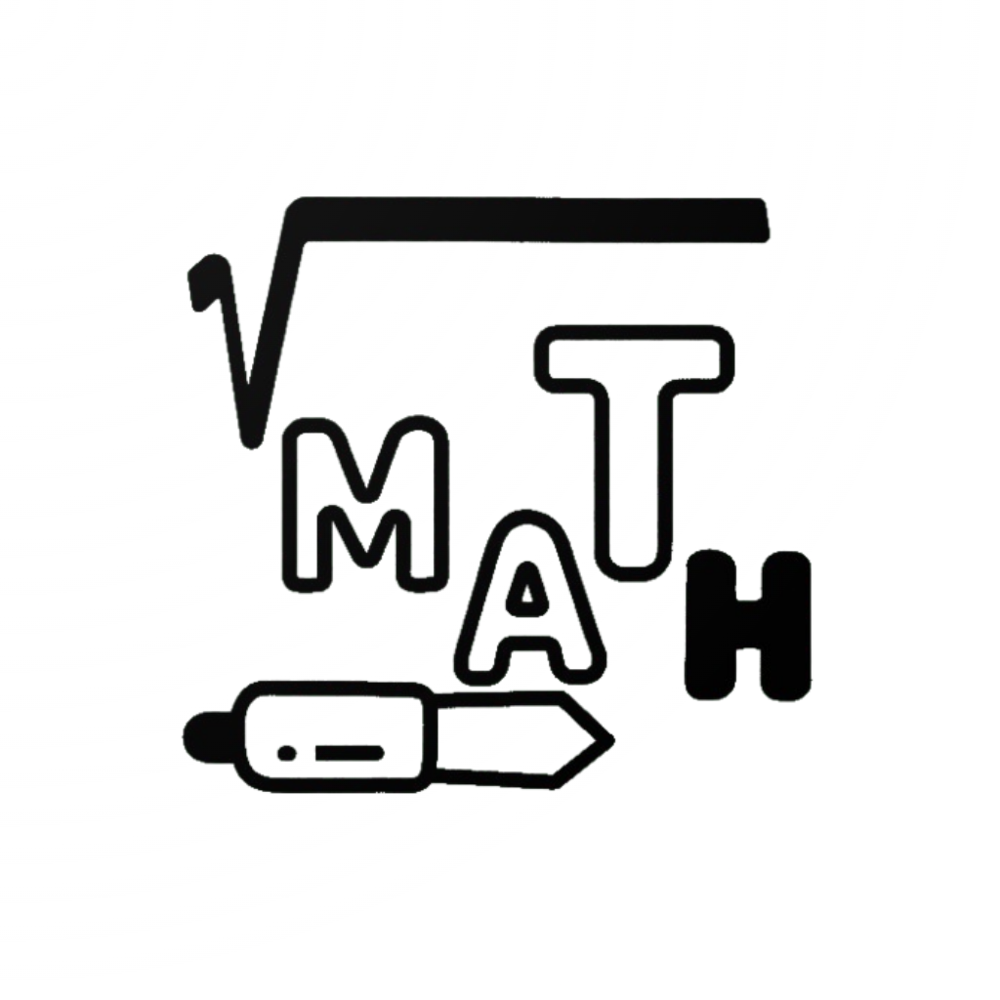

# MathScribble AI 



**(Winning App of the February Hackathon Challenge)**

MathScribble AI is an innovative Flutter application that transforms handwritten mathematical expressions into digital solutions using advanced AI recognition models. The app combines specialized handwriting recognition with powerful mathematical computation capabilities.

## Key Features

- **Smart Drawing Tools**: Multiple grid types (square, coordinate, isometric) with customizable colors and stroke widths
- **Real-time Recognition**: Instant conversion of handwritten mathematical expressions to digital format
- **Step-by-Step Solutions**: Detailed explanations and mathematical rules for each solution step
- **History & Progress Tracking**: Comprehensive history of solved problems with progress monitoring

     

You can download an android APK from here ==>  [MathScribble AI](https://drive.google.com/file/d/1vCtXadkCY_QPxeLLvz3SEHv0zzAB946K/view?usp=sharing)

## Model Architecture 🧠

### Recognition and Solution Approaches

1. **Option 1: Gemini 2.0 Flash**
   - **Capabilities**: Both recognition and solving
   - Recognition through image analysis
   - Advanced problem-solving with step-by-step solutions
   - Comprehensive explanations of mathematical rules
   - API key rotation for scalability

2. **Option 2: Hybrid Approach**
   - **Recognition**: Handwriting API (specialized for math symbols)
   - **Solving**: Gemini 2.0 Flash
   - More focused recognition but potentially slower due to service switching

### Why Two Options?

1. **Flexibility**
   - Gemini provides an all-in-one solution
   - Handwriting API offers specialized recognition when needed
   - Users can choose based on their needs

2. **Scalability**
   - API key rotation system for Gemini
   - Load balancing between services
   - Fallback options available

3. **Reliability**
   - Multiple recognition paths
   - Robust error handling
   - Service redundancy

## Technical Implementation 💻

### Service Layer

```dart
class MixedHandwritingService extends AbstractMathService {
  late HandwritingApiService _handwritingService;
  late GeminiApiService _geminiService;
}
```

- Coordinates between services
- Handles initialization and error management
- Maintains state consistency

### Recognition Pipeline

1. Stroke Collection
2. Path Processing
3. Symbol Recognition (via chosen service)
4. LaTeX Conversion
5. Expression Standardization

### Solution Generation

1. Expression Parsing
2. Mathematical Analysis
3. Step-by-step solution generation
4. Rule identification and explanation
5. Result Verification

## Feature Screens
### 1. Onboarding Experience

The app starts with an engaging onboarding flow that introduces key features:

- Smart Math Recognition with AI-powered conversion

- Multiple Drawing Tools with customizable grids

- Step-by-Step Solutions with detailed explanations

- Comprehensive history


https://github.com/user-attachments/assets/7c930d19-4aa7-4b5b-a0ce-b6d4c337c7fe

### 2. Dashboard Screen

The main dashboard features:

- App logo and branding

- Four interactive feature cards:

  - Smart Drawing Tools (✏️)

  - Real-time Recognition (🔄)

  - Step-by-Step Solutions (📊)

  - History & Progress (📝)

- Model Selection button for choosing recognition approach

### 3. Model Selection

Two recognition models available:

- Gemini 2.0 Flash: All-in-one solution for recognition and solving

- MathHandwriting Model: Specialized handwriting recognition
  
https://github.com/user-attachments/assets/ca96a0ef-fc07-4b65-bc6f-5a2c50cd2d71


https://github.com/user-attachments/assets/86a0d44c-5cba-4377-80b4-506a40a824d6

### 4. Drawing Canvas

Advanced drawing interface with:

- Customizable toolbar with:

  - Pen and eraser tools

  - Color palette selection

  - Stroke width adjustment

  - Grid type selection (none, square, coordinate, isometric)

- Undo/redo functionality

- Clear canvas option

- Real-time recognition button

### 5. Solution Display

Results presentation featuring:

- Recognized LaTeX expression

- Step-by-step solution breakdown

- Mathematical rules explanation

https://github.com/user-attachments/assets/dd3d4170-d8a8-49a1-903d-a91b52249fcc


### 6. History Screen

Comprehensive history tracking:

- List of solved problems

- Timestamp for each solution

- Recognition model used

- Expression and solution details

- Steps and rules applied


https://github.com/user-attachments/assets/d8c0fae6-0e68-4650-b600-a3885df4800c


## Setup Instructions 🚀

### Prerequisites

- Flutter SDK (Latest stable version)
- Dart SDK (>=3.4.0)
- Android Studio / VS Code with Flutter extensions
- API Keys (Handwriting API and Gemini)


### Installation

1. Clone the repository:
   ```bash
   git clone https://github.com/amandangol/mathscribble-ai.git
   cd mathscribble-ai
   ```

2. Set up environment variables:
   
   Create a `.env` file in the root directory:
   ```env
   # Multiple Gemini API keys for rotation (comma-separated) / OR you can use single API Key too
   GEMINI_API_KEYS=key1,key2,key3,key4

   # Handwriting API token
   HANDWRITING_API_TOKEN=your_handwriting_api_token
   ```

3. Create environment configuration file (`lib/config/env_config.dart`):
   ```dart
   import 'package:flutter_dotenv/flutter_dotenv.dart';

   class EnvConfig {
     static List<String> get geminiApiKeys {
       final keys = dotenv.env['GEMINI_API_KEYS']?.split(',') ?? [];
       return keys.map((key) => key.trim()).toList();
     }

     static String get handwritingApiToken {
       return dotenv.env['HANDWRITING_API_TOKEN'] ?? '';
     }
   }
   ```

4. Install dependencies:
   ```bash
   flutter pub get
   ```

5. Run the app:
   ```bash
   flutter run
   ```

### Configuration

- Adjust API key rotation settings in `GeminiApiService`
- Configure cooldown periods for rate limiting
- Customize recognition parameters in `HandwritingApiService`

## Innovation Assessment 🎯

1. **Flexible Architecture**
   - Multiple recognition options
   - Service switching capability
   - Robust error handling

2. **Scalability Features**
   - API key rotation system
   - Cooldown management
   - Load distribution

3. **User Experience**
   - Real-time recognition
   - Intuitive drawing tools
   - Comprehensive solution explanations

4. **Technical Innovation**
   - Custom path processing
   - Advanced symbol recognition
   - Intelligent error recovery

## Future Enhancements 🔮

1. **Offline Mode**
   - Local model integration
   - Cached solutions
   - Sync mechanism

2. **Advanced Features**
   - Multi-language support
   - Graph plotting
   - Problem generation

3. **Performance Optimization**
   - Enhanced caching
   - Batch processing
   - Memory optimization

## Development Notes

- The app requires SDK version >=3.4.0
- Uses Material Design components
- Implements custom font families (JetBrainsMono, Rubik, OpenSans, Outfit)
- Supports environment-based configuration
